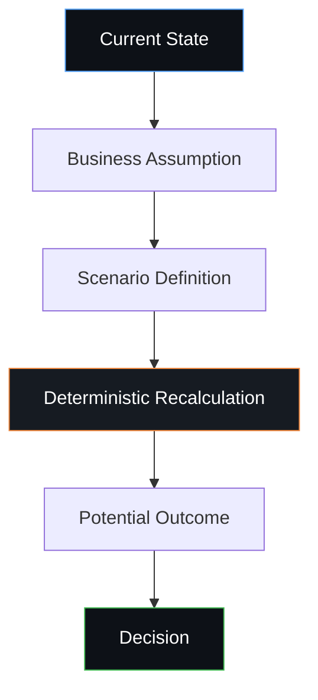

<div align="center">

# 🔬 InsightX

### From KPI Movement to Business Decision

**An AI-powered decision intelligence engine that detects material business changes,<br>investigates their drivers, explains the evidence, communicates uncertainty,<br>and recommends governed actions.**

[](LICENSE)
[](index.html)
[](package.json)
[](EVALUATION_GUIDE.md)

---

*InsightX doesn't ask businesses to trust an AI answer.*
*It builds a traceable path from change → evidence → explanation → uncertainty → action.*

</div>

---

## 🚀 Judge's 3-Minute Walkthrough

> **InsightX is not another BI dashboard.**
>
> A traditional dashboard tells you: *"Revenue decreased 8%."*
>
> InsightX answers the five questions that follow:
> **Why did it happen? · Which drivers matter most? · How strong is the evidence? · What should we do next? · Can we trust the recommendation?**

| Step | Action | What You'll See |
|:----:|:-------|:----------------|
| 🟢 **1** | Open the **Command Center** | 📈 KPI landscape with auto-prioritized material movements |
| 🔵 **2** | Select a KPI movement | 🔎 Transition from headline metric into structured investigation |
| 🟣 **3** | **Run the Investigation** | ⚙️ The analytical pipeline identifies and ranks potential drivers |
| 🟠 **4** | Inspect the **Evidence** | 🧾 Trace the explanation back to data lineage, calculations, and source context |
| 🔴 **5** | Open the **Decision Lab** | 🧪 Test alternative assumptions and evaluate potential business actions |
| ⚫ **6** | Try an **uncertain scenario** | ⚠️ See how InsightX communicates low confidence instead of pretending to know |

> [!IMPORTANT]
> **The goal is not to generate the most confident answer. The goal is to generate the most defensible decision.**

---

## 🎯 The Problem

Modern businesses have no shortage of dashboards.
The problem is what happens **after** a KPI changes.

Business teams routinely have to:

1. 🔍 Hunt for the important KPI movements manually
2. 🔗 Pull data from disparate systems
3. ⏱️ Reconcile different refresh times and granularities
4. 🧩 Identify possible drivers
5. ✅ Validate whether the explanation is actually supported by evidence
6. 📝 Translate analysis into a business narrative
7. ⚖️ Decide whether the evidence is strong enough to act on
8. 🎯 Determine what action is actually available
9. 📣 Communicate the conclusion to different stakeholders

This creates a gap:

```
  Data  →  Insight  →  Decision  →  Action
    ╰────────────── the gap ──────────────╯
```

**InsightX is designed to close that gap.**

---

## 💡 The InsightX Approach

InsightX treats KPI investigation as a **decision workflow**, not a chatbot interaction.

```mermaid
graph LR
    A["📊 Business Data<br>KPIs · Transactions<br>Context · Metadata"] --> B["1. DETECT<br>Material Movements"]
    B --> C["2. RECONCILE<br>Data + Business Context"]
    C --> D["3. INVESTIGATE<br>Candidate Drivers"]
    D --> E["4. CORROBORATE<br>Evidence + Lineage"]
    E --> F["5. EXPLAIN<br>Persona-Specific Narrative"]
    F --> G["6. ACT<br>Actions · Scenarios<br>Decision Gates"]

    style A fill:#1a1a2e,stroke:#e94560,color:#fff
    style B fill:#16213e,stroke:#0f3460,color:#fff
    style C fill:#16213e,stroke:#0f3460,color:#fff
    style D fill:#16213e,stroke:#0f3460,color:#fff
    style E fill:#16213e,stroke:#0f3460,color:#fff
    style F fill:#16213e,stroke:#0f3460,color:#fff
    style G fill:#1a1a2e,stroke:#e94560,color:#fff
```



---

## ⭐ What Makes InsightX Different?

### 1. 🎯 Detection Before Explanation
The system **prioritizes material movements** so analysts focus attention where it matters — not on manually searching every KPI.

### 2. 📐 Evidence Before Narrative
InsightX separates quantitative computation from language generation. The LLM is **never** treated as the source of quantitative truth.

```
  Deterministic Calculations
           ↓
  Statistical / Analytical Methods
           ↓
  Evidence & Business Context
           ↓
  Confidence Assessment
           ↓
  LLM Narrative Generation
           ↓
  Human Decision
```

> This architecture reduces the risk of an LLM inventing numbers or presenting unsupported explanations.

### 3. 🔍 Explainability Is Part of the Product
An explanation should answer: *"Why should I believe this?"*

Every conclusion surfaces: **Driver ranking** · **Supporting evidence** · **Data lineage** · **Source context** · **Calculation transparency** · **Confidence score** · **Contradictory evidence** · **Uncertainty**

The user can trace the path:
**KPI → Driver → Evidence → Decision**

### 4. 🛑 The System Can Abstain

> [!WARNING]
> A dangerous decision system is one that **always** produces an answer.

InsightX is designed around the opposite principle: if the evidence is insufficient or contradictory, confidence decreases and the system recommends **REVIEW** instead of pretending certainty.

**Uncertainty is a first-class output**, not something hidden from the user.

### 5. ⚡ Insight → Action
The investigation doesn't end with *"Revenue decreased because of Region X."*

The next question is: *"What can the business actually do about it?"*

InsightX connects analysis to: **Business levers** · **Constraints** · **Decision rights** · **Scenario analysis** · **Recommended actions** · **Decision gates**

---

## 🧠 The Six-Stage Intelligence Pipeline

| Stage | Name | Purpose |
|:-----:|:-----|:--------|
| 1️⃣ | **🚨 Detect** | Identify and prioritize material KPI movements |
| 2️⃣ | **🔗 Reconcile** | Bring together heterogeneous data sources, business definitions, refresh cadences, and granularities |
| 3️⃣ | **🔬 Investigate** | Analyze candidate drivers using deterministic, statistical, and analytical techniques |
| 4️⃣ | **✅ Corroborate** | Evaluate evidence quality, lineage, and consistency before accepting a driver |
| 5️⃣ | **💬 Explain** | Generate persona-specific narratives grounded in analytical evidence |
| 6️⃣ | **🎬 Act** | Translate investigation into practical actions, scenarios, constraints, and decision gates |

---

## 🔬 Trust Architecture

> **Central design principle:** *The LLM should interpret evidence — not manufacture it.*

```
┌──────────────────────────┐
│       Raw Data           │
└────────────┬─────────────┘
             ▼
┌──────────────────────────┐
│  Deterministic Layer     │   Calculations, baselines, thresholds
│  Authoritative Truth     │
└────────────┬─────────────┘
             ▼
┌──────────────────────────┐
│  Analytical Layer        │   Statistics, drivers, ML
│  Analytical Truth        │
└────────────┬─────────────┘
             ▼
┌──────────────────────────┐
│  Evidence & Context      │   Lineage, quality, provenance
│  Grounded Retrieval      │
└────────────┬─────────────┘
             ▼
┌──────────────────────────┐
│  LLM Synthesis           │   Persona-adaptive narrative,
│  Interpretation Only     │   investigation orchestration
└────────────┬─────────────┘
             ▼
┌──────────────────────────┐
│  Decision Gate           │   Human oversight,
│  Human Governance        │   audit trail
└──────────────────────────┘
```

| Layer | Responsibility | Guarantee |
|:------|:---------------|:----------|
| **Deterministic** | Numerical truth — calculations, baselines, thresholds | LLM **never** computes or invents numeric values |
| **Analytical** | Analytical truth — time-series, anomaly detection, variance decomposition | Results from algorithmic models, not language generation |
| **Evidence** | Contextual grounding — semantic contracts, entity resolution, audit logging | Every evidence node has verifiable provenance |
| **LLM Synthesis** | Interpretation & narrative — persona adaptation, action explanation | Synthesizes **exclusively** from verified facts |

---

## 📊 Core Capabilities

| Capability | Purpose |
|:-----------|:--------|
| 📈 **KPI Prioritization** | Find material movements instead of making users search manually |
| 🧭 **Guided Investigation** | Structured analytical pipeline from symptom to potential cause |
| 🏆 **Driver Ranking** | Identify the most relevant explanatory factors |
| 🕸️ **Evidence Graph** | Connect conclusions to supporting evidence with lineage |
| 📊 **Confidence Scoring** | Communicate strength of evidence transparently |
| 🛑 **Abstention** | Avoid false certainty when evidence is weak or contradictory |
| 👥 **Persona Narratives** | Present findings appropriately for different stakeholders |
| 🧪 **Decision Lab** | Explore assumptions and possible business outcomes |
| 🚪 **Decision Gates** | Keep recommendations within business constraints and authority |
| 🔄 **Feedback Loop** | Allow analyst corrections to improve future investigations |

---

## 🔍 Example Investigation

Consider a KPI movement: **Revenue ↓ 8.4%**

A traditional dashboard stops there. InsightX continues:

```
Revenue ↓ 8.4%
│
├── Region A
│   └── Revenue ↓ 14%
│       ├── Product Segment B
│       │   └── Volume ↓ 11%
│       └── Customer Cohort C
│           └── Churn ↑ 6%
│
└── Pricing
    └── No material change
```

**System output:**

| Field | Value |
|:------|:------|
| 🎯 **Primary Driver** | Region A volume decline |
| 📋 **Evidence** | Multiple supporting signals |
| 📊 **Confidence** | High / Medium / Low |
| ⚡ **Contradictory Signals** | Surfaced if present |
| 💡 **Recommended Action** | Investigate Region A pipeline and retention |
| 🚪 **Decision Gate** | Regional sales owner |

> [!NOTE]
> The narrative is **downstream** of the analysis — not the source of it.

---

## 🧪 Evaluation Scenarios

### Scenario A — Strong Evidence ✅
A material KPI movement has multiple supporting signals.

**Expected behavior:** Identify movement → Rank driver → Show supporting evidence → Generate grounded narrative → Recommend action with confidence.

### Scenario B — Conflicting Evidence ⚠️
Different signals point in different directions.

**Expected behavior:** Surface contradictory evidence → Reduce confidence → Avoid overconfident conclusions → Escalate for human review.

### Scenario C — Insufficient Evidence 🛑
A KPI changes but available evidence is insufficient to establish a reliable cause.

**Expected behavior:**
```
┌────────────────────────────────────────┐
│   ⚠️  ABSTAIN / REVIEW REQUIRED       │
│                                        │
│   Evidence is insufficient to          │
│   establish a reliable cause.          │
│                                        │
│   Action: Collect more data,           │
│   NOT generate recommendations.        │
└────────────────────────────────────────┘
```

> [!CAUTION]
> **This scenario is critical.** A trustworthy decision system must know when *not* to answer.

---

## 🧪 Decision Lab — Scenario Analysis

InsightX supports the transition from *"What happened?"* to *"What happens if we change something?"*



Decision-makers can reason about **potential actions** rather than simply consume historical reporting.

---

## 🛡️ Governance & Enterprise Readiness

InsightX is designed with enterprise decision-making constraints in mind:

| Capability | Description |
|:-----------|:------------|
| 🔐 **Role-Based Access** | Domain-isolated permissions and decision rights |
| 👤 **Decision Rights** | Routing matrix based on confidence and risk level |
| 🧬 **Data Lineage** | Every evidence node traced to source system and timestamp |
| 📜 **Semantic Contracts** | Formal KPI specifications — formulas, grain, SLAs, owners |
| 📊 **Confidence & Uncertainty** | Transparent scoring with full breakdown |
| 🛑 **Abstention** | Mandatory abstention when evidence is insufficient |
| 🔏 **Auditability** | Cryptographic audit trail for every decision |
| 💬 **Analyst Feedback** | Human corrections captured for continuous improvement |
| ⚡ **Cost & Latency Awareness** | Selective use of AI where it adds real value |

> The goal is not simply to make AI generate an answer.
> The goal is to make AI-generated decisions **inspectable, constrained, and accountable**.

---

## 🏗️ Architecture

```
┌──────────────────────────────────────────────────────────┐
│                      InsightX UI                          │
│  Command Center │ Investigation │ Evidence │ Decision Lab │
└───────────────────────────┬──────────────────────────────┘
                            │
┌───────────────────────────▼──────────────────────────────┐
│              Intelligence Orchestration                    │
└────────┬──────────────────┬──────────────────┬───────────┘
         │                  │                  │
   ┌─────▼─────┐     ┌─────▼─────┐     ┌──────▼─────┐
   │Deterministic│    │Analytical │     │ Evidence & │
   │   Logic    │     │ / ML      │     │  Context   │
   └─────┬─────┘     └─────┬─────┘     └──────┬─────┘
         │                  │                  │
         └──────────────────┼──────────────────┘
                            │
                   ┌────────▼────────┐
                   │  LLM Synthesis  │
                   └────────┬────────┘
                            │
                   ┌────────▼────────┐
                   │  Decision Gate  │
                   │ Human Oversight │
                   └─────────────────┘
```

### Repository Structure

```
insightx-decision-intelligence/
│
├── index.html              # Application shell & view templates
├── style.css               # Design system & custom UI
├── app.js                  # Application controllers & charts
├── data.js                 # Enterprise dataset & semantic contracts (JS)
├── data.json               # Pure JSON export for automated evaluation
├── package.json            # Node.js config & npm scripts
│
├── README.md               # ← You are here
├── ARCHITECTURE.md         # Technical design & mathematical formulations
├── EVALUATION_GUIDE.md     # Evaluator rubric & step-by-step test guide
└── LICENSE                 # MIT
```

---

## 🖥️ Quick Start

The application is **entirely self-contained** — zero build steps, zero complex dependencies.

### 🐍 Option 1 — Python 3 (Recommended)
```bash
git clone https://github.com/abhishekanandmec/insightx-decision-intelligence.git
cd insightx-decision-intelligence
python3 -m http.server 8000
```

### 📦 Option 2 — Node.js
```bash
git clone https://github.com/abhishekanandmec/insightx-decision-intelligence.git
cd insightx-decision-intelligence
npm start
```

### 🌐 Option 3 — Zero Install
Open `index.html` directly in any modern browser.

Then visit: **[WEBSITE]([http://localhost:8000](https://abhishekanandmec.github.io/insightx-decision-intelligence/?utm_source=chatgpt.com))**

---

## 🧭 Design Principles

| # | Principle | Rationale |
|:-:|:----------|:----------|
| 01 | 🎯 **Truth before fluency** | A well-written explanation is useless if the underlying numbers are wrong |
| 02 | 📐 **Evidence before confidence** | Confidence should reflect evidence quality |
| 03 | ❓ **Uncertainty is an output** | The system should communicate when it does not know |
| 04 | 🔒 **Decisions need constraints** | A recommendation is only useful if someone has authority to execute it |
| 05 | 🤝 **Human feedback is valuable data** | Analyst corrections should become part of the learning loop |
| 06 | 🧠 **AI should be selective** | Use AI where reasoning and synthesis add value — not where deterministic computation is safer and cheaper |

---

## 💰 Cost, Latency & Scalability

InsightX separates **deterministic computation**, **analytical processing**, **retrieval/evidence**, and **LLM synthesis** — allowing expensive AI reasoning to be used selectively.

> **Design goal:** Use deterministic systems for truth, analytical systems for evidence, and LLMs where language and synthesis provide real value.

---

## 🔄 Learning From Human Feedback

```
Investigation → Recommendation → Human Feedback
                                       ↓
                                  Evaluation
                                       ↓
                          Improved Rules / Models / Retrieval
                                       ↓
                             Better Investigation
```

Feedback signals include: ✅ **Correct driver** · ❌ **Incorrect driver** · 🔍 **Missing evidence** · 📝 **Incorrect narrative** · 💡 **Useful recommendation** · 🔄 **Needs review**

---

## 🔮 Roadmap

| Horizon | Focus Areas |
|:--------|:------------|
| 🟢 **Near Term** | More enterprise data connectors · Stronger driver attribution · Automated evidence quality checks · Expanded scenario models · More persona-specific narratives |
| 🟡 **Medium Term** | Continuous learning from analyst feedback · Automated investigation planning · More sophisticated causal analysis · Production-grade observability · Enterprise identity integration |
| 🔴 **Long Term** | An intelligent decision layer across an organization's fragmented data ecosystem — maintaining **Accuracy + Evidence + Uncertainty + Governance + Actionability** |

---

## 🚧 Prototype Boundaries

> Being explicit about these boundaries is intentional.

This repository is a **competition prototype**, not a production enterprise deployment. Some capabilities are represented through prototype implementations, simulated data, or architectural demonstrations rather than production infrastructure.

A production version would additionally require: production data connectors · data quality infrastructure · enterprise auth & identity · model evaluation infra · observability · secrets management · high-scale orchestration · production audit storage · automated regression testing · deployment infrastructure.

**The prototype demonstrates the decision-intelligence workflow and architecture** rather than claiming production readiness.

---

## 🏆 Why InsightX?

Most analytics systems optimize for: *"Show me the data."*
Many AI systems optimize for: *"Give me an answer."*

**InsightX is designed around a different question:**

> ### *"Give me an evidence-backed path from what changed to what we should do next."*

```
🔔 WHAT CHANGED?         →  Detection & Prioritization
❓ WHY?                  →  Driver Investigation & Ranking
📋 WHAT EVIDENCE?        →  Cross-Source Corroboration
📊 HOW CONFIDENT?        →  Transparent Confidence Scoring
🧪 WHAT IF...?           →  Counterfactual Scenario Lab
💡 WHAT SHOULD WE DO?    →  Governed Recommendations
👤 WHO CAN DECIDE?       →  Decision Gates & RBAC
```

---

<div align="center">

### 📌 Final Takeaway

**InsightX doesn't ask businesses to trust an AI answer.**

It builds a traceable path from<br>
**KPI movement → evidence → explanation → uncertainty → action.**

*Because the best AI decision system isn't the one that always answers.<br>
It's the one that knows why it believes an answer — and when it shouldn't.*

---

**Built with ❤️ by Team InsightX**

</div>
